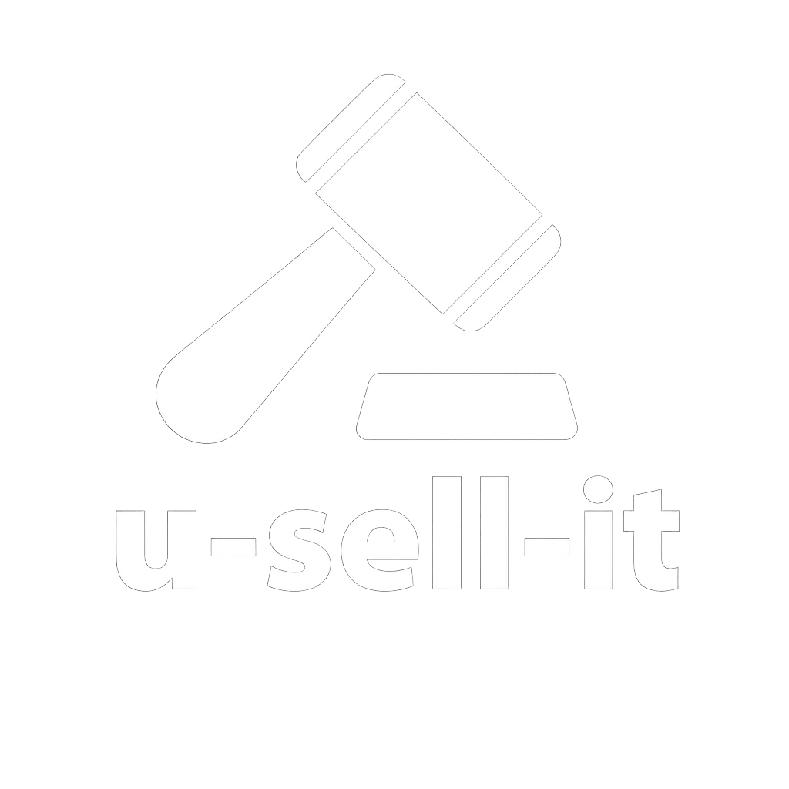

<p aling="center">
  
</p>

# 🛍️ u-sell-it (Standalone Desktop App)

**u-sell-it** is a standalone desktop application in active development, designed to help users buy, sell, and trade items locally. Built with a modular architecture and refined user interface, this app is the foundation for a scalable offline-first platform focused on community commerce.

---

## 🚧 Development Status

This project is currently in its early stages:

- ✅ **Login screen** completed (PyQt6)
- 🔄 **Registration form** in progress
- 🧩 Backend integration via C++ DLL planned
- 📦 Future modules will include item listings, user profiles, and transaction tracking

> Note: This is a desktop application, not a web-based `.com` platform.

---

## 🚀 Planned Features

- **Login/Register UI (PyQt6)**
  - Transparent overlays and professional layout
  - Two-column field arrangement for clarity and flow
  - Dynamic resizing and label positioning
  - Custom icons and assets for branded presentation

- **Backend Integration (C++ DLL)**
  - Secure function calls via statically linked `.dll`
  - Cross-language communication via `ctypes` or `cffi`
  - Modular backend design for future expansion

- **Standalone Execution**
  - No internet required for core functionality
  - Lightweight and fast startup
  - Designed for future growth into a connected platform

---

## 🧱 Architecture

- **Frontend**: PyQt6
- **Backend**: C++ (compiled into `.dll`)
- **Design Philosophy**:
  - Modular components
  - Fully commented codebase
  - Separation of concerns
  - UI/UX refinement through iterative testing

---

## 📦 Assets Included

- Login screen icons and layout files
- Screenshot of the `.py` UI implementation

---

## 📥 Installation

**u-sell-it** will be packaged as a standalone Windows executable using Inno Setup Compiler.

> Installer will be available once the registration form and backend wiring are complete.

---

## 🧭 Roadmap

1. ✅ Login screen
2. 🔄 Registration form
3. 🧩 Backend DLL integration
4. 📦 Local item listing and browsing module
5. 🧾 Transaction logging and user profiles
6. 🌎 Optional internet-connected features (future)

> ⚠️ Note: The antivirus module is part of a separate application and is not included in u-sell-it.

---

## 🛠️ How to Run (Dev Mode)

If you're running from source:

```bash
python main.py
